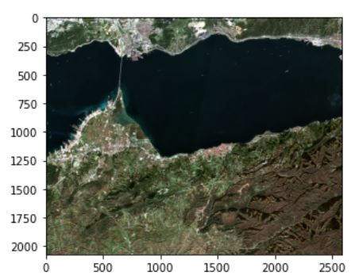
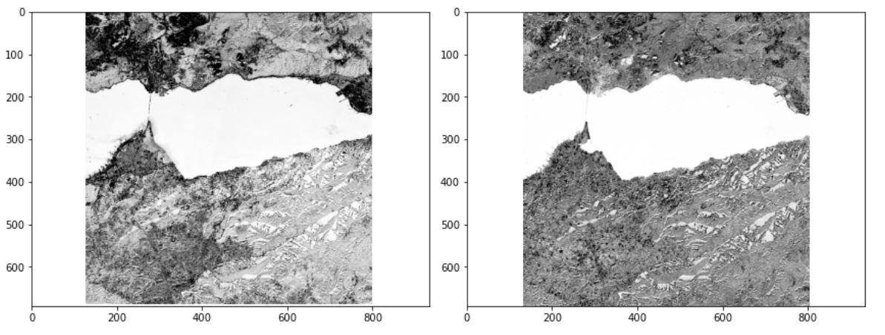
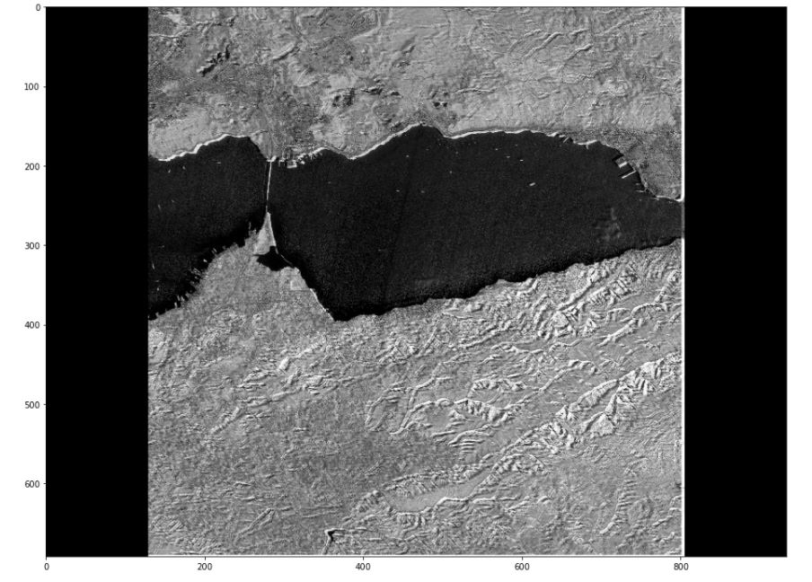
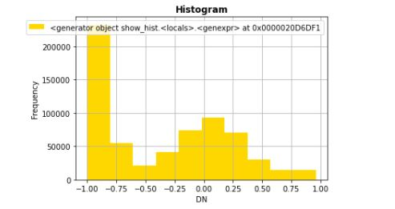

# Special Topics in Remote Sensing Homework
## Basic Ship and Bridge Detection by Using Normalized Difference Water Index
### Fatmanur Himmet 0101626
This code calculates the NDWI of Sentinel 2A image in Kocaeli Gulf region. Satellite image taken from this area shows Osmangazi Bridge and ships on the sea. So the NDWI enable us to separate these ships, the bridge and coastal line from the sea. 

***
### Image Properties
Sentinel 2A image which is taken from the satellite the date 12.08.2020. 

***
### Used Image Bands
- __Band 4, Band 3 and Band 2 which are Red, Green and Blue Bands for RGB True Colors__
- __Band 8 which is NIR Band__

***
### Jupyter Notebook which have pyhton 3.6.12 version and its libraries in conda environment were used in this project.
 __Libraries__
- Rasterio
- Matplotlib
- Numpy
- Opencv

***
### __The RGB colors of the image is shown:__ 
-
### __Band3 and Band8 Plots which are Used for NDWI:__
-

-NDWI = Band3 - Band8 / Band3 + Band8

## Outputs

"""
-__#export NDWI image__
-ndwiImage = rasterio.open('Desktop/sentinel_output_ndwi.tif','w',driver='Gtiff',
-                          width=band8.width, 
-                          height = band8.height, 
-                          count=1, crs=band8.crs, 
-                          transform=band8.transform,
-                         dtype='float64')
-ndwiImage.write(ndwi,1)
-ndwiImage.close()
-#plot NDWI
-ndwiImage = rasterio.open('Desktop/sentinel_output_ndwi.tif') 
-fig = plt.figure(figsize=(18,12))
-plot.show(ndwiImage, cmap='gray')
 """
 ### __Output NDWI Plot:__
 -
 
 __Creating Histogram__
 '''
 #plot a histogram NDWI
def image_histogram(ndwi2):
    from rasterio.plot import show_hist
    co, ce =show_hist(ndwi)
    fig = plt.figure(figsize=(10,7))
    fig.set_facecolor('yellow')
    plt.plot(ce[1::], co[1::])
    plt.show()
get_ipython().run_line_magic('matplotlib', 'inline')
image_histogram(ndwi2)
'''
 
 ### __NDWI Histogram Plot:__
 -
 
 ### References
 - Basic Ship Detection in Remote Sensing by Sehn Körtig
 - NDVI Calculation by Hatari Lab
 - Dealing with Geospatial Raster Data in Python with Rasterio (Medium.com)
 
